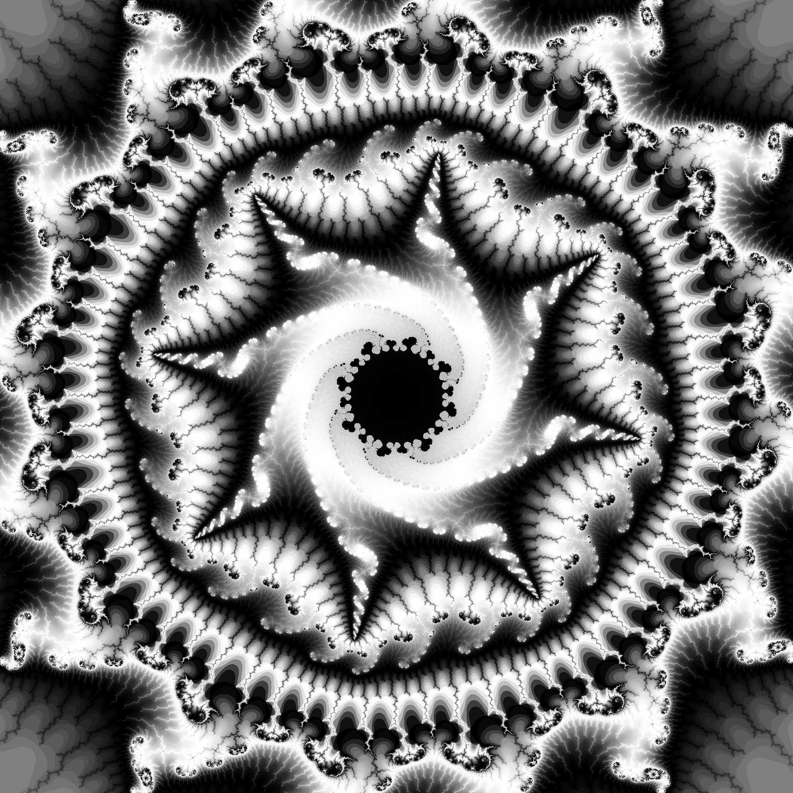

ckormanyos/mandelbrot\
[](https://github.com/ckormanyos/mandelbrot/actions)
==================

The Mandelbrot set consists of those points

in the complex plane
(i.e., )
for which the iteration


with


stays bounded.

ckormanyos/mandelbrot implements a header-only C++ template library for
extended precision Mandelbrot fractal iterations.

It is intended to be used for so-called _deep_ _dives_ in the fractal iteration
world. These potentially involve high-precision floating-point
such as those found in
[Boost.Multiprecison](https://www.boost.org/doc/libs/1_78_0/libs/multiprecision/doc/html/index.html).
Also fixed-point types having sufficient precision (although these have not yet been used or tested
extensively in this project) should work well.

## Design

This project uses [Boost.Multiprecison](https://www.boost.org/doc/libs/1_78_0/libs/multiprecision/doc/html/index.html)
to implement
a high-precision Mandelbrot iteration and visualization.
Graphic file creation uses
[Boost.Gil](https://www.boost.org/doc/libs/1_78_0/libs/gil/doc/html/index.html) to wrap the JPEG-6b library (see below).
Color-strething in combination with the histogram method
is used for creating vivid images. The default color
scheme uses stretched, amplified and modulated black
and white coloring. The Mandelbrot iteration is carried
out with hardware concurrency with multiple threads.
The multithreading dispatcher uses
)
of the available CPU cores that can be found using hardware concurrency.

The following design goals have been incorporated.
  - ckormanyos/mandelbrot is written in header-only C++11, and compatible through C++11, 14, 17, 20.
  - The inner loop performing the work of fractal iteration uses multiple, parallel CPU cores.
  - C++ template design allows for flexible use of any appropriate kind of big-number type.
  - Visualization of the result uses color-stretching techniques combined with the histogram method.
  - Graphical representation uses [Boost.Gil](https://www.boost.org/doc/libs/1_78_0/libs/gil/doc/html/index.html) in combination with the JPEG-6b library (see below).
  - Color schemes can be easily adapted via straightforward creation (or modification) of a skinny derived class.

## Sample Images

In these particular images from ckormanyos/mandelbrot, we have
concentrated on various beautiful iteration results
represented in pure black-and-white/gray-scale tones.

Several images are highlighted in the paragraphs below.
Please see the [gallery](./images/gallery)
for a more comprehensive collection of images.

### Classic Full Mandelbrot Image

A black-and-white rendition of the well-known, classic full Mandelbrot iteration is shown below.
The image has the following features and parameters.

  - The square image has  pixels.
  - Centered at the point ).
  - Uses a half-width of .
  - Computed with  iteratons using the `cpp_dec_float` type from [Boost.Multiprecison](https://www.boost.org/doc/libs/1_78_0/libs/multiprecision/doc/html/index.html) instantiated with  decimal digits of precision.


### Swirly Seahorses and Mini Mandelbrot

A beautiful iteration result showing swirly seahorses and a mini Mandelbrot image
in black-and-white color representation is shown below. The image
has the following features and parameters.

  - The square image has  pixels.
  - Centered at the point ).
  - Uses a half-width of .
  - Computed with  iteratons using the `cpp_dec_float` type from [Boost.Multiprecison](https://www.boost.org/doc/libs/1_78_0/libs/multiprecision/doc/html/index.html) instantiated with  decimal digits of precision.


### A Deep Dive

The following deep dive has a scale of approximately
.

The result of this deep dive iteration is represented by the image below.
It has the the following features and parameters.

  - The square image has  pixels.
  - Centered at the point )
  - See the configuration code [mandelbrot_cfg_MANDELBROT_09_DEEP_DIVE_02.h](./mandelbrot/cfg/mandelbrot_cfg_MANDELBROT_09_DEEP_DIVE_02.h) for the full precision of the center point.
  - Uses a half-width of .
  - Computed with  iteratons using the `cpp_dec_float` type from [Boost.Multiprecison](https://www.boost.org/doc/libs/1_78_0/libs/multiprecision/doc/html/index.html) instantiated with  decimal digits of precision.



### A Really Deep Dive

My personal best deep dive has a scale of approximately
.
This is a huge magnification factor having a scale of approximately

followed by

zeros.

The result of this very deep dive iteration is represented by the image below.
It has the the following features and parameters.

  - The square image has  pixels.
  - Centered at the point )
  - See the configuration code [mandelbrot_cfg_MANDELBROT_20_ZOOM_VERY_DEEP_00.h](./mandelbrot/cfg/mandelbrot_cfg_MANDELBROT_20_ZOOM_VERY_DEEP_00.h) for the full precision of the center point provided with slightly more than  decimal places.
  - Uses a half-width of .
  - Computed with  iteratons using the `gmp_float` type from [Boost.Multiprecison](https://www.boost.org/doc/libs/1_78_0/libs/multiprecision/doc/html/index.html) instantiated with  decimal digits of precision.


## Using ckormanyos/mandelbrot

ckormanyos/mandelbrot uses configuration files to specify the point,
size and depth of the iterative fractal calculation.
The configuration files are stored in the [mandelbrot/cfg](./mandelbrot/cfg)
directory.

The code responsible for controlling the iterative calculation,
performing color-stretching and writing the output file
is written in a generic and configurable way.

To characterize a new Mandelbrot fractal iteration, simply write
a header-configuration-file with content similar to that shown below.
Include the configuration file in
[test_mandelbrot.cpp](./test/test_mandelbrot.cpp) and run the calculation.

Consider as a sample, for instance, the relevant content of the configuration file
[mandelbrot_cfg_MANDELBROT_01_FULL.h](./mandelbrot/cfg/mandelbrot_cfg_MANDELBROT_01_FULL.h).

```cpp
  // This is the classic full immage.

  #define MANDELBROT_FILENAME_STRING            "MANDELBROT_01_FULL"

  #define MANDELBROT_CALCULATION_DIGITS10       37
  #define MANDELBROT_CALCULATION_PIXELS_1D      2048UL
  #define MANDELBROT_CALCULATION_ITERATIONS     2000UL

  #define MANDELBROT_POINT_DX_HALF              +1.25L
  #define MANDELBROT_POINT_CENTER_X             -0.75L
  #define MANDELBROT_POINT_CENTER_Y             +0.0L

  #include <mandelbrot/cfg/mandelbrot_cfg.h>
```

Clearly named definitions are used to specify:

  - the output file name,
  - the number of decimal digits of precision (in the big-number type used in the iteration),
  - the numbers of pixels and iterations,
  - and the coordinate center and half-width of the magnification region.

## Adaptions of and Notes on jpeg-6b

We use a modified version of jpeg-6b.
It is located [here](./jpeg-6b-2022).
According to license agreement, this work is referred to as
_the_ _Independent_ _JPEG_ _Group's_ _software_.
Please see their
[original _README_](https://github.com/ckormanyos/mandelbrot/tree/main/jpeg-6b-2022#readme)
in its entirety for more information about and licensing terms
of _the_ _Independent_ _JPEG_ _Group's_ _software_.
