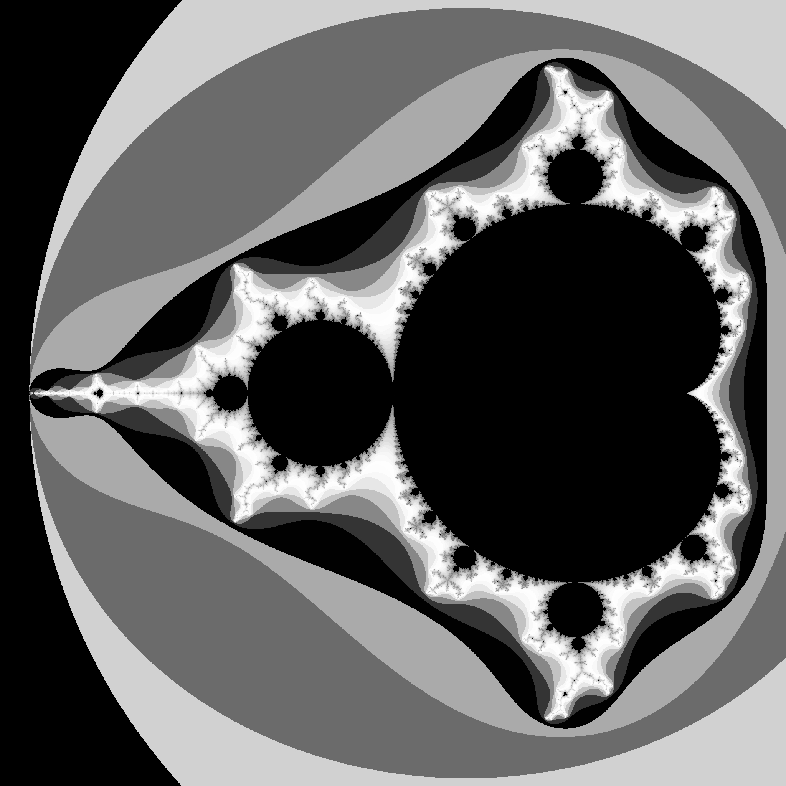
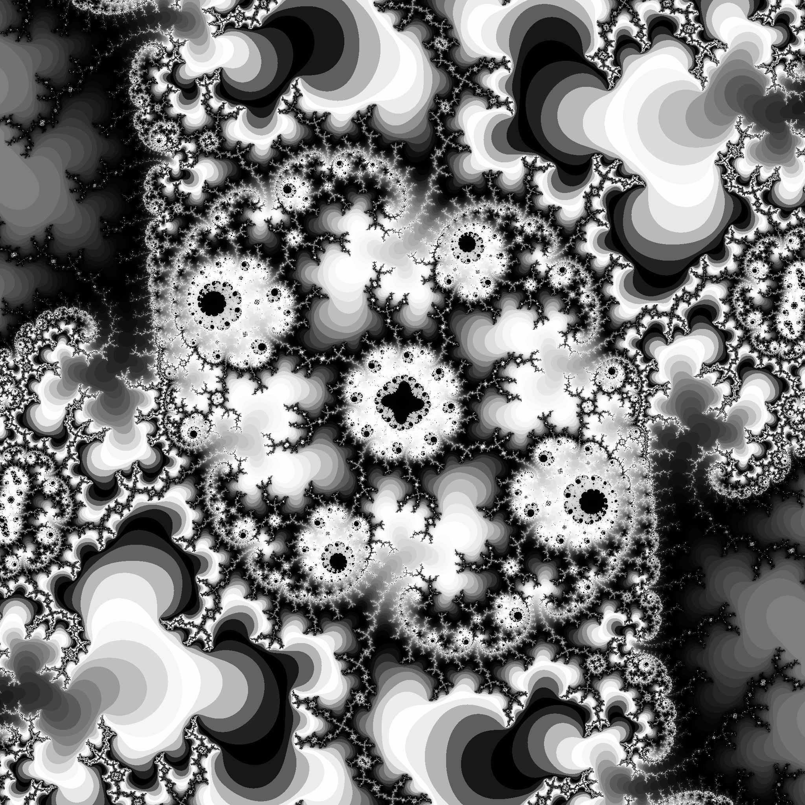

ckormanyos/mandelbrot
==================

<p align="center">
    <a href="https://github.com/ckormanyos/mandelbrot/actions">
        </a>
    <a href="https://github.com/ckormanyos/mandelbrot/issues?q=is%3Aissue+is%3Aopen+sort%3Aupdated-desc">
        </a>
    <a href="https://sonarcloud.io/summary/new_code?id=ckormanyos_mandelbrot">
        </a>
    <a href="https://codecov.io/gh/ckormanyos/mandelbrot">
        </a>
    <a href="https://github.com/ckormanyos/mandelbrot/blob/master/LICENSE_1_0.txt">
        </a>
    <a href="https://github.com/ckormanyos/mandelbrot" alt="Activity">
        </a>
    <a href="https://github.com/ckormanyos/mandelbrot" alt="GitHub code size in bytes">
        </a>
</p>

The Mandelbrot set consists of the set of points $c$
in the complex plane for which the iteration

$$z_{n+1} = z_{n}^2 + c {\phantom{.}} ,$$

where $z_{0} = 0$ and $z {\phantom{.}} {\in} {\phantom{.}} {\mathbb{C}}$, stays bounded.

ckormanyos/mandelbrot implements a header-only C++ template library for
extended precision Mandelbrot fractal iterations.

It is intended to be used for so-called _deep_ _dives_ in the fractal iteration
world. These potentially involve high-precision floating-point
such as those found in
[Boost.Multiprecison](https://www.boost.org/doc/libs/1_80_0/libs/multiprecision/doc/html/index.html).
Also fixed-point types having sufficient precision (although these have not yet been used or tested
extensively in this project) should work well.

## Design

This project uses [Boost.Multiprecison](https://www.boost.org/doc/libs/1_80_0/libs/multiprecision/doc/html/index.html)
to implement
a high-precision Mandelbrot iteration and visualization.
Graphic file creation uses
[Boost.Gil](https://www.boost.org/doc/libs/1_80_0/libs/gil/doc/html/index.html) to wrap the JPEG-6b library (see [below](#Adaptions-of-and-Notes-on-jpeg-6b)).
Color-strething in combination with the histogram method
is used for creating vivid images. The default color
scheme uses stretched, amplified and modulated black
and white coloring. The Mandelbrot iteration is carried
out with hardware concurrency with multiple threads.
The multithreading dispatcher uses $(n-1)$
of the available CPU cores that can be found using hardware concurrency.

The following design goals have been incorporated.
  - ckormanyos/mandelbrot is written in header-only C++11, and compatible through C++11, 14, 17, 20.
  - The inner loop performing the work of fractal iteration uses multiple, parallel CPU cores.
  - C++ template design allows for flexible use of any appropriate kind of big-number type.
  - Visualization of the result uses color-stretching techniques combined with the histogram method.
  - Graphical representation uses [Boost.Gil](https://www.boost.org/doc/libs/1_80_0/libs/gil/doc/html/index.html) in combination with the JPEG-6b library (see [below](#Adaptions-of-and-Notes-on-jpeg-6b)).
  - Color schemes can be easily adapted via straightforward creation (or modification) of a skinny derived class.

## Building the Project

### Build on `Win*` with MSVC

  - Locate the solution file `mandelbrot.sln` in the root dierctory.
  - Open the solution file in Visual Studio.
  - Build the desired configuration and run in the usual way.
  - The resulting JPEG image will be placed as a temporary file in the `images\tmp\` folder.

### Build on with `*nix`

  - Build the JPEG library with GNUmake.
  - Compile, link and run `test_mandelbrot.cpp`.
  - The resulting JPEG image will be placed as a temporary file in the `images/tmp/` folder.
  - This build makes and uses its own specialized version of the JPEG-6b library (see [below](#Adaptions-of-and-Notes-on-jpeg-6b)) and does not install or use a standard `*nix` version thereof.

Use shell commands such as the following.

Go to the `mandelbrot/jpeg` directory and make the JPEG library. This creates the library file `libjpeg-6b.a` located in the directory `mandelbrot/jpeg/jpeg-6b-2022/obj`.

```sh
cd mandelbrot/jpeg
make all
```

Go to (or go back to) the mandelbrot root directory.

```sh
cd mandelbrot
```

Compile `test_mandelbrot.cpp` to `test_mandelbrot.o`.
This compile step requires an installed Boost-C++ library.
Otherwise, the location of your Boost C++ library headers needs to be included
with a `-I` switch on the compiler command line.

```sh
g++ -c -finline-functions -march=native -mtune=native -O3 -Wall -Wextra -std=c++11 -I. -Ijpeg/jpeg-6b-2022 -pthread test/test_mandelbrot.cpp -o test_mandelbrot.o
```

Link `test_mandelbrot.o` to `test_mandelbrot.exe`.

```sh
g++ test_mandelbrot.o -lpthread -ljpeg-6b -Ljpeg/jpeg-6b-2022/obj -o test_mandelbrot.exe
```

Make the needed output image directory and run `test_mandelbrot.exe`.

```sh
mkdir -p images/tmp
./test_mandelbrot.exe
```

In `*nix`, it is also possible to optionally make use of GMP
via Boost.Multiprecision's `gmp_float` backend
(instead of the default `cpp_dec_float` backend).
When doing so, define `-DMANDELBROT_USE_GMP_FLOAT`
on the command line in the compile `test_mandelbrot.cpp` stage.
In this case, you also need to link with `-lgmp` in the link stage.

## TODOs

Improvements on the TODO list include (among others) the following.
  - Experiment with (and implement) massive inner loop parallelization via GPU programming.
  - Find/use an acceleration technique (intended to reduce required precision of deep dives) such as orbit perturbation, series expansion, etc.

## Sample Images

Several images are highlighted in the paragraphs below.
Please see the [gallery](./images/gallery) of ckormanyos/mandelbrot
for a more comprehensive collection of images.

In these particular images presented from the [gallery](./images/gallery)
of ckormanyos/mandelbrot,
we have concentrated on various beautiful iteration results
represented in pure black-and-white/gray-scale tones.

### Classic Full Mandelbrot Image

A black-and-white rendition of the well-known, classic full Mandelbrot iteration is shown below.



This image has the following features and parameters.

  - The square image has $2048 {\times} 2048$ pixels.
  - Centered at the point $(-0.75,0.0)$.
  - Uses a half-width of $1.25$.
  - Computed with $2,000$ iteratons using the `cpp_dec_float` type from [Boost.Multiprecison](https://www.boost.org/doc/libs/1_80_0/libs/multiprecision/doc/html/index.html) instantiated with $37$ decimal digits of precision.

### Swirly Seahorses and Mini Mandelbrot

A beautiful iteration result showing swirly seahorses and a mini Mandelbrot image
in black-and-white color representation is shown below.


This image has the following features and parameters.

  - The square image has $2048 {\times} 2048$ pixels.
  - Centered at the point $(-0.7453983606667815,0.1125046349959942)$.
  - Uses a half-width of $1.76{\times}10^{-12}$.
  - Computed with $2,000$ iteratons using the `cpp_dec_float` type from [Boost.Multiprecison](https://www.boost.org/doc/libs/1_80_0/libs/multiprecision/doc/html/index.html) instantiated with $37$ decimal digits of precision.

### A Deep Dive

The following deep dive has a scale of approximately
$2.55{\times}10^{-55}$.
The result of this deep dive iteration is represented by the image below.


This image has the the following features and parameters.

  - The square image has $2048 {\times} 2048$ pixels.
  - Centered at the point $(-1.2951890821477774570170641771856819267{\ldots},0.44093698267832013888090367835626261211{\ldots})$.
  - See the configuration code [mandelbrot_cfg_MANDELBROT_09_DEEP_DIVE_02.h](./mandelbrot/cfg/mandelbrot_cfg_MANDELBROT_09_DEEP_DIVE_02.h) for the full precision of the center point.
  - Uses a half-width of $2.55{\times}10^{-55}$.
  - Computed with $15,000$ iteratons using the `cpp_dec_float` type from [Boost.Multiprecison](https://www.boost.org/doc/libs/1_80_0/libs/multiprecision/doc/html/index.html) instantiated with $95$ decimal digits of precision.

### A Really Deep Dive

My personal best deep dive has a scale of approximately $10^{-311}$.
This is a huge magnification factor having a scale of approximately
$1$ followed by $311$ zeros.
The result of this very deep dive iteration
is represented by the image below.



This image has the the following features and parameters.

  - The square image has $1536 {\times} 1536$ pixels.
  - Centered at the point $(0.3602404434376143632361252444495453084{\ldots},-0.6413130610648031748603750151793020665{\ldots})$.
  - See the configuration code [mandelbrot_cfg_MANDELBROT_20_ZOOM_VERY_DEEP_00.h](./mandelbrot/cfg/mandelbrot_cfg_MANDELBROT_20_ZOOM_VERY_DEEP_00.h) for the full precision of the center point provided with slightly more than $1,000$ decimal places.
  - Uses a half-width of $4.4 {\times} 10^{-311}$.
  - Computed with $60,000$ iteratons using the `gmp_float` type from [Boost.Multiprecison](https://www.boost.org/doc/libs/1_80_0/libs/multiprecision/doc/html/index.html) instantiated with $365$ decimal digits of precision.

## Using ckormanyos/mandelbrot

ckormanyos/mandelbrot uses configuration files to specify the point,
size and depth of the iterative fractal calculation.
The configuration files are stored in the [mandelbrot/cfg](./mandelbrot/cfg)
directory.

The code responsible for controlling the iterative calculation,
performing color-stretching and writing the output file
is written in a generic and configurable way.

To characterize a new Mandelbrot fractal iteration, simply write
a header-configuration-file with content similar to that shown below.
Include the configuration file in
[test_mandelbrot.cpp](./test/test_mandelbrot.cpp) and run the calculation.

Consider as a sample, for instance, the relevant content of the configuration file
[mandelbrot_cfg_MANDELBROT_01_FULL.h](./mandelbrot/cfg/mandelbrot_cfg_MANDELBROT_01_FULL.h).

```cpp
  // This is the classic full immage.

  constexpr char MANDELBROT_FILENAME_STRING[]       = "MANDELBROT_01_FULL";

  constexpr int  MANDELBROT_CALCULATION_DIGITS10    =      37;
  constexpr int  MANDELBROT_CALCULATION_PIXELS_1D   =    2048;
  constexpr int  MANDELBROT_CALCULATION_ITERATIONS  =    2000;

  constexpr char MANDELBROT_POINT_DX_HALF[]         = "1.25";
  constexpr char MANDELBROT_POINT_CENTER_X[]        = "0.75";
  constexpr char MANDELBROT_POINT_CENTER_Y[]        = "0.0";

  #include <mandelbrot/cfg/mandelbrot_cfg.h>
```

Clearly named definitions are used to specify:

  - the output file name,
  - the number of decimal digits of precision (in the big-number type used in the iteration),
  - the numbers of pixels and iterations,
  - and the coordinate center and half-width of the magnification region,
  - where the dimensions `MANDELBROT_POINT_DX_HALF`, `MANDELBROT_POINT_CENTER_X`, and `MANDELBROT_POINT_CENTER_Y` are provided as character strings, which remain exact even if the magnification scale requires multiple precision.

## Adaptions of and Notes on jpeg-6b

We use a modified version of jpeg-6b.
It is located [here](./jpeg-6b-2022).
According to license agreement, this work is referred to as
_the_ _Independent_ _JPEG_ _Group's_ _software_.
Please see their
[original _README_](https://github.com/ckormanyos/mandelbrot/tree/main/jpeg-6b-2022#readme)
in its entirety for more information about and licensing terms
of _the_ _Independent_ _JPEG_ _Group's_ _software_.

The following adaptions have been performed.

  - Test/compile only the subset of functions empirically found to be needed for use with [Boost.Gil](https://www.boost.org/doc/libs/1_80_0/libs/gil/doc/html/index.html).
  - Adapt to VS compiler and VS solution workspace (when building with MSVC).
  - Use GNUmake to build the JPEG library (when building on `*nix`).
  - Run the `*.c`/`*.h` files through the [Artistic Style](http://astyle.sourceforge.net/astyle.html) automatic code formatter, using a version of _AStyle_ from somewhere around 2015.
  - Remove several unused preprocessor options such as short names for linkers.
  - Eliminate all uses of `NEED_FAR_POINTERS` and `NEED_SHORT_EXTERNAL_NAMES`.
  - Handle Level-3 warnings found in MSVC.
  - Handle GCC warnings from `-Wall`, `-Wextra`, `-pedantic`, `-Wconversion` and `-Wsign-conversion`.
